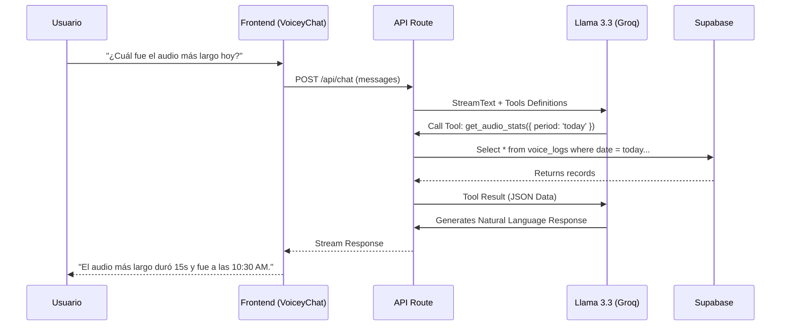

# 🎙️ App Detector de Voz + Voicey AI 🤖


Bienvenido a **App Detector de Voz**, una aplicación moderna de detección y análisis de audio en tiempo real. Este proyecto no solo escucha, sino que **entiende** tus datos gracias a **Voicey**, un asistente de IA integrado con capacidad de análisis profundo mediante **WebMCP**.

---

## 🚀 Características Principales

### 🎧 Detector de Voz
- **Monitoreo en Tiempo Real**: Visualización de niveles de decibelios (dB) en vivo.
- **Transcripción Automática**: Conversión de voz a texto usando servicios avanzados.
- **Registro Histórico**: Guardado automático de eventos en Supabase.

### 🤖 Voicey AI (Asistente Inteligente)
- **Chat Contextual**: Conversa con tus datos. Voicey no es un chatbot genérico; conoce tus registros de audio.
- **WebMCP Integrado**: Arquitectura basada en herramientas (Tools) que permite a la IA ejecutar consultas reales a la base de datos.
- **Análisis Proactivo**: Pídele reportes como "¿Cuál fue el audio más ruidoso de hoy?" o "Dame un resumen de la semana".

---

## 🏗️ Arquitectura & WebMCP

Este proyecto implementa el patrón **WebMCP (Model Context Protocol)** utilizando el Vercel AI SDK. Esto permite que el modelo de lenguaje (Llama 3.3 via Groq) tenga "brazos y piernas" para interactuar con tu base de datos de forma segura.

### 📊 Flujo de Datos (Mermaid)

```mermaid
flowchart TD
    User[👤 Usuario]
    Mic[🎤 Micrófono]
    
    subgraph Frontend [Next.js Client]
        Detector[Detector Component]
        Chat[💬 VoiceyChat]
    end
    
    subgraph Backend [Next.js API Routes]
        API_Chat[/api/chat/]
        Tools[🛠️ WebMCP Tools]
    end
    
    subgraph Cloud [Servicios Externos]
        Groq[🧠 Groq AI (Llama 3.3)]
        Supabase[(🗄️ Supabase DB)]
    end

    User -->|Habla| Mic
    Mic -->|Audio| Detector
    Detector -->|Guarda Log| Supabase
    
    User -->|Pregunta| Chat
    Chat -->|Mensaje| API_Chat
    API_Chat -->|Contexto + Tools| Groq
    Groq -->|Llama Tool?| API_Chat
    API_Chat -->|Ejecuta| Tools
    Tools -->|Consulta| Supabase
    Supabase -->|Datos| Tools
    Tools -->|Resultado| Groq
    Groq -->|Respuesta Final| Chat
    Chat -->|Muestra| User
```

### 🔄 Ciclo de Vida de una Consulta WebMCP



---

## 🛠️ Herramientas WebMCP Disponibles

Voicey tiene acceso a las siguientes herramientas definidas en `src/app/api/chat/tools.ts`:

| Herramienta | Descripción | Parámetros |
|-------------|-------------|------------|
| `get_audio_stats` | Calcula estadísticas (máximos, promedios) de los logs. | `period`: 'today', 'week', 'month', 'all' |
| `get_recent_logs` | Obtiene los últimos N registros crudos. | `limit`: número (1-50) |
| `control_detector` | (Beta) Ajusta sensibilidad del detector. | `action`: 'get_config', 'set_sensitivity' |

---

## 💻 Instalación y Configuración

Sigue estos pasos para desplegar tu propio detector con IA.

### Prerrequisitos
- Node.js 18+
- Cuenta en [Supabase](https://supabase.com)
- API Key de [Groq](https://groq.com)

### 1. Clonar el repositorio
```bash
git clone https://github.com/tu-usuario/app-detector-de-voz.git
cd app-detector-de-voz
```

### 2. Instalar dependencias
```bash
npm install
```

### 3. Configurar Variables de Entorno
Crea un archivo `.env.local` en la raíz:

```bash
# Supabase
NEXT_PUBLIC_SUPABASE_URL=tu_supabase_url
NEXT_PUBLIC_SUPABASE_ANON_KEY=tu_supabase_anon_key
SUPABASE_SERVICE_ROLE_KEY=tu_service_role_key # Para uso seguro en servidor

# AI Provider
GROQ_API_KEY=tu_groq_api_key
```

### 4. Ejecutar en desarrollo
```bash
npm run dev
```
Abre [http://localhost:3000](http://localhost:3000) y prueba el detector.

---

## 🎨 Stack Tecnológico

- **Frontend**: Next.js 15 (App Router), React 19.
- **Estilos**: TailwindCSS, Lucide React (Iconos).
- **Backend/DB**: Supabase (PostgreSQL + Realtime).
- **Inteligencia Artificial**:
  - **SDK**: Vercel AI SDK (`ai`, `@ai-sdk/react`).
  - **Modelo**: Llama 3.3 70B Versatile (via Groq).
  - **Protocolo**: WebMCP (Tool Calling Pattern).

---

Desarrollado con ❤️ y mucha cafeína.
